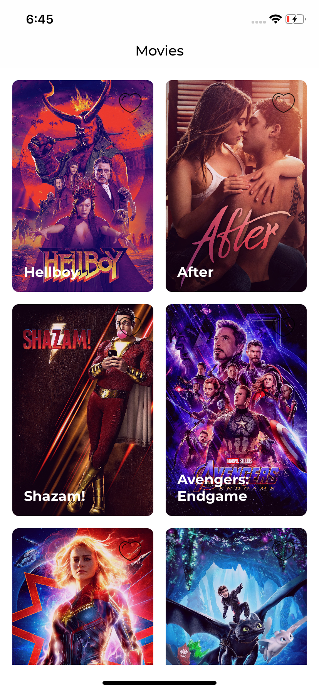
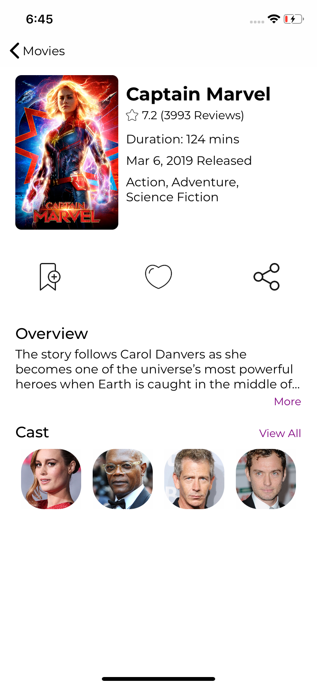
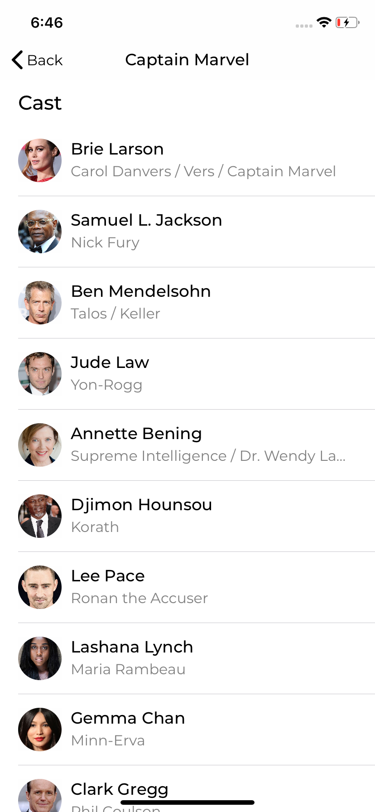

# MoviesDB

IOS application written using Swift 4.2. It uses VIPER architecture.

## Images

### Prerequisites

Xcode 10.1
Swift 4.2

## Authors

* **Yogesh Pareek** - *Initial work* - [yogeshpareek09](https://github.com/yogeshpareek09)

## License

This project is licensed under the MIT License - see the [LICENSE.md](LICENSE.md) file for details

## Acknowledgments

* Hat tip to anyone whose code was used
* Inspiration
* etc

